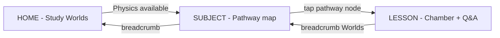

# Study Assistant / Cognitive Learning System — Copilot Context

> **Purpose of this document:** Give GitHub Copilot (or any assistant) enough structured truth to understand what this project *is trying to become*, what it *already does*, what it *stores*, and where the codebase has **forks, duplicates, and gaps** — so you can choose a coherent path forward without re-explaining the vision every session.

**Primary app surface today:** `cognitive-pwa/` — React + TypeScript PWA (`npm run dev` from `cognitive-pwa`).

**Repo also contains:** Python `backend/` (AI + memory + graph coordinator), `ui_flow/` (desktop-style UI experiments), `StudyOS/` (scheduler/reminders variant). Those are **not wired into the PWA entrypoint** (`App.tsx` → `LearningApp` only). Treat them as sibling experiments unless you explicitly integrate them.

---

## 1. What you are building (one paragraph)

A **spatial, memory-driven learning world** — not a quiz app with a skin. The learner moves through **Subjects → Pathways → Lessons → Questions** inside an **atmospheric 3D-ish interface** where:

- **Progress is felt** (maps, tunnels, glow, presence trail) rather than read from dashboards.
- **The lesson chamber** is one continuous cognitive space: persistent physics anchor (bowling ball / hockey puck), overlays only, vertical question flow.
- **Mastery is derived** from answers and signals, then reflected back as visual state (graph engine, map nodes, trail intensity) — not stored as “UI mode.”

The product goal: **reduce cognitive load** by making structure *environmental* and making interaction *one attention column* (teach → ask → inline feedback → continue).

---

## 2. North-star principles (do not violate casually)

| Principle | Meaning |
|-----------|---------|
| **Single visual truth in lesson** | During a lesson: physics scene + Q&A only. No side maps, no duplicate hierarchy panels. |
| **Persistent scene anchor** | Bowling ball (etc.) **never unmounts** across question / curiosity / feedback. Only overlays and CSS change. |
| **Memory → Graph → Render** | Raw learning data does not paint pixels. A graph layer derives `locked \| learning \| mastered \| confused`, then render applies **diffs**. |
| **Diff-based updates** | Prefer patching DOM/CSS over remounting React trees for the living world. |
| **Presence, not avatar** | User = energy trail / signal on the **map layer only**, not a walking character or identity picker. |
| **Question type follows phase** | Understanding → MCQ/T-F. Application → + numeric. Mastery → numeric + mixed. Not random. |
| **Inviting, not crowded** | One metaphor per subject tile, one motion layer, one glow color. No badge soup. |

---

## 3. Conceptual model (curriculum hierarchy)

```
Domain (Subject)     Physics | Chemistry | Biology
    └── Pathway      e.g. motion-forces, energy, electricity
            └── Module / Lesson slot   (world map nodes + lesson index)
                    └── Lesson         teach block + question set + scene graph
                            └── Phase  understanding | application | mastery
                                    └── Question   MCQ | TRUE_FALSE | NUMERIC_INPUT
                            └── Curiosity nodes    why | what_if | how_change (in-lesson only)
```

**Locked content contract:** `src/content/curriculum/graphTypes.ts`  
**Runtime loader:** `src/content/curriculum/curriculumGraphLoader.ts` → `Lesson` in `src/content/curriculumTypes.ts`  
**Legacy inline chapters:** `src/content/physicsChapter1.ts`, `energyChapter1.ts`, `electricityChapter1.ts` (wrapped with `phasedMcqQuestions` where needed)

**Physics v1 graph manifest:** `src/content/curriculum/physics_v1/physics_v1.graph.json`  
- Module `motion_module`: Lesson 1 (`lesson_force_01.json`) fully phased with T/F + numeric; Lesson 2 (`lesson_inertia_01.json`) large MCQ set (phase often inferred by index).

---

## 4. User journey (PWA — what ships in `LearningApp`)



### Screen responsibilities

| `NavScreen` | UI | Role |
|-------------|-----|------|
| `HOME` | Living subject tiles (`SubjectNode` + SVG metaphors) | Pick Physics / Chemistry / Biology “world” |
| `SUBJECT` | `SubjectPathwayMapView` — serpentine map, tunnels, pathway nodes, **presence trail** | Spatial progression; tap pathway → **enters lesson directly** (no separate PATHWAY screen in normal flow) |
| `LESSON` | `ConceptVisualChamber` + vertical Q&A (`QuestionAnswerControls`) + curiosity + cognitive bar | Actual learning |

**Removed from user-facing flow (by design):** duplicate concept maps in lesson sidebar, `PathwayHighwayView` in main nav, PATHWAY as a persistent nav step (sanitized on session restore).

---

## 5. Visual system (what each layer should feel like)

### 5.1 World home — subject entry tiles

- **Physics:** force field, abstract profile silhouette, drifting vectors, cyan/electric blue glow.
- **Chemistry:** flask + molecule lattice + bubbles, neon green/lime (tile visible; subject locked “Soon”).
- **Biology:** DNA helix + cell network pulse, amber/gold (tile visible; locked).
- **Motion:** 18–28s CSS/SVG cycles, low opacity; parallax tilt on pointer; soft shadow for 2.5D.
- **Files:** `src/components/subject-tiles/*`, `src/styles/subject-tiles.css`

### 5.2 Subject map — one map layer

- Pathways as nodes on a serpentine layout; **tunnels** show fog ahead, lit path behind user.
- **World progress entity:** orb + particle trail; reacts to answers via `emitPresenceTrail` (`src/world/presenceTrail.ts`).
- **Not in lesson UI** — trail is map-only.

### 5.3 Lesson chamber — persistent anchor world

Layers (back → front):

1. **Environment** — chamber background, ambient particles, structural veins (`lesson-chamber.css`, `AmbientBackground`).
2. **Persistent anchor** — bowling ball / hockey puck DOM; registered with `AnchorRegistry` via `useLessonAnchor`.
3. **Dynamic overlays** — motifs, force arrows, collision, curiosity effects; change per question/mode **without remounting anchor**.
4. **UI column** — minimal strip (lesson name, phase · Q n/N), question, answers flush below, two-stage feedback + fixed Continue.

**Files:** `src/visuals/LessonVisualScene.tsx`, `src/visuals/ConceptVisualChamber.tsx`, `src/styles/lesson-chamber.css`, `src/styles/learning-app.css`

---

## 6. Engine architecture (four layers)

```
┌─────────────────────────────────────────────────────────────┐
│  UI Layer          LearningApp, QuestionAnswerControls      │
├─────────────────────────────────────────────────────────────┤
│  Lesson Engine     useLearningEngine (TEACH/ASK/FEEDBACK/…)   │
├─────────────────────────────────────────────────────────────┤
│  Render Engine     RenderEngine, AnchorRegistry, CSS diffs  │
├─────────────────────────────────────────────────────────────┤
│  Graph Engine      GraphEngine, deriveNodeState, computeDiff│
├─────────────────────────────────────────────────────────────┤
│  Memory Engine     memoryStore, MemoryEngine.readTruth      │
└─────────────────────────────────────────────────────────────┘
```

**Orchestrator:** `src/learning-world/LearningWorld.ts`  
- Listens for `MEMORY_UPDATED_EVENT` (`src/memory/memoryEvents.ts`).
- Derives graph state → computes diff → applies to map hosts + anchor overlays.

**Important:** `CurriculumWorldHost` / map `RenderEngine` exist but are **not mounted in `LearningApp` today**. The living graph map UI was removed from lesson/sidebar; backend graph pipeline remains for future map integration or dev tools.

**Node states (derived, never persisted):** `locked | learning | mastered | confused`  
**Animation mapping:** `src/learning-world/graph/animationRules.ts`

---

## 7. Lesson flow (modes)

| Mode | User sees | Engine |
|------|-----------|--------|
| `TEACH` | Key idea + explanation | Continue → `ASK` |
| `ASK` | Question + answer control | Submit → `FEEDBACK` |
| `FEEDBACK` | Short preview → deep dive → Continue (fixed button) | Continue → next question or `ADVANCE` |
| `ADVANCE` | Module checkpoint | Unlocks next lesson index |

**Pass gate:** `lesson.masteryRules.passThreshold` (e.g. 3 correct on Lesson 1) — not a fixed global constant.

**Question selection:** `src/memory/questionSelector.ts` — unseen first, then weak-concept reinforcement, then sequential.

**Answer types:** `src/engine/questionTypes.ts` + `src/ui/lesson/QuestionAnswerControls.tsx`  
**Engine:** `src/engine/learningEngine.ts` — `onSelectAnswer`, `onSubmitNumeric`, records to memory, fires presence trail pulses.

---

## 8. What memory stores (authoritative for PWA)

**Single consolidated key:** `localStorage["cls:learning-memory:v1"]` → `LearningMemory` (`src/memory/types.ts`)

| Slice | Contents | Used for |
|-------|----------|----------|
| `session` | pathway id, per-pathway slice (lesson index, question index, mode, selections), `navScreen`, visual snapshot | Resume app position |
| `performance` | answer log, seen question ids, attempt counts | Adaptive pick, analytics hooks |
| `concept` | per-concept tier, mastery score, confusion, reinforcement flags | Weak concept targeting |
| `curriculum` | completed lesson/pathway ids, per-pathway unlock index | Map unlocks, gates |
| `graphMemory` | **placeholders** — conceptMastery, questionHistory, confusionMap keys | Structural hooks from JSON lessons; full scoring TBD |
| `signals` | understanding signal events | Cognitive layer |
| `reinforcementQueue` | flashcard-like cards from misses | Future reinforcement UI |

**Secondary / parallel stores (legacy experiments — not unified):**

| Key | Module | Notes |
|-----|--------|-------|
| `cls:learning-world:v1` | `core/worldGraph/worldEngine.ts` | Alternate world graph UI — not main app |
| `cls:cognitive-graph:v1` | `data/storage.ts`, `core/graph/cognitiveGraph.ts` | Older graph experiments |
| `cls:cognitive-memory:v1` | `core/cognition/cognitiveStore.ts` | Separate cognition store |
| `cls:learning:mvp:v1` | `core/state/learningState.ts` | MVP state machine |
| `cls:learning-events:v1` | `core/learning/learningEventStore.ts` | Event log |
| `cls:memory:flashcards:v1` etc. | `core/memory/*` | Fragmented memory modules |

**Copilot guidance:** New features should extend `LearningMemory` unless you are deliberately deprecating the monolith and migrating.

**Cognitive layer (in-lesson):** `src/cognitive/progressionStore.ts` — ties to signals, alternate explanations, reinforcement queue population on wrong answers (`useCognitiveLayer`).

---

## 9. Content pipeline (how lessons get into the app)

1. Author JSON under `src/content/curriculum/physics_v1/.../*.json` matching `graphTypes.ts`.
2. Thin TS re-export: `lesson_force_01.ts` imports JSON.
3. `getGraphLessonsForMotionModule()` builds `Lesson[]` for motion-forces pathway.
4. `physicsChapter1.ts` = graph lessons + inline lessons 3–5 (legacy MCQ, auto-phased).
5. `chapterRegistry.ts` maps `PathwayId` → `Lesson[]`.

**Scene persistence fields in JSON:** `scene.persistentAnchor`, `dynamicOverlayPolicy: "overlays_only"`, `defaultMotifs`, `curiosityNodes`, `memoryHooks`, `masteryRules`.

---

## 10. Key directories (PWA)

```
cognitive-pwa/src/
├── App.tsx                    # Entry → useLearningEngine → LearningApp
├── ui/LearningApp.tsx         # All screens, lesson shell
├── ui/world/                  # Subject map, tunnels, breadcrumbs
├── ui/lesson/                 # QuestionAnswerControls
├── engine/                    # learningEngine, questionTypes
├── memory/                    # memoryStore, types, sessionRestore
├── content/curriculum/        # graphTypes, JSON lessons, loader
├── learning-world/            # Memory→Graph→Render (4-layer)
├── visuals/                   # LessonVisualScene, motifs, chamber
├── world/                     # physicsWorld metadata, presenceTrail
├── components/                # SubjectNode, CuriosityNodes, orb, etc.
├── cognitive/                 # tiers, signals, progressionStore
├── styles/                    # learning-app, lesson-chamber, subject-tiles
└── core/                      # ⚠ parallel experiments (not main path)
```

---

## 11. Python backend (sibling — different stack)

`backend/coordinator.py` — `SystemCoordinator`:

`User input → AI → Memory → Graph → Notification`

Layers mirror the *idea* of the PWA learning-world stack but use Python engines (`backend/ai`, `backend/memory`, `backend/graph`, `backend/notifications`) and likely SQLite/files via `storage.py`.

**Not connected to `cognitive-pwa` runtime today.** Useful if you want server-side AI tutoring, sync, or unified memory across devices.

`ui_flow/main_layout.py` — large desktop UI surface (graph workspace, cognitive modes) — conceptual cousin, separate deployment.

---

## 12. Current maturity snapshot (honest)

### Working well

- End-to-end Physics home → map → lesson → phased questions (L1) with T/F and numeric.
- Persistent bowling ball + overlay-only scene policy in lesson.
- Vertical attention funnel + two-stage feedback + fixed Continue.
- Subject tiles with distinct metaphors and motion.
- Subject pathway map with tunnels, next/active/mastered states, presence trail hooks.
- Unified `LearningMemory` v1 with session restore (PATHWAY nav sanitized to SUBJECT).
- Curriculum graph JSON contract for lessons 1–2.

### Partial / stubbed

- `graphMemory` placeholders written on answer; not full concept graph persistence.
- `learning-world` map `RenderEngine` — built but not in main `LearningApp` UI.
- Chemistry / Biology subjects — visual tiles only; `available: false`.
- Pathways waves, thermodynamics — locked.
- Lessons 3–5 — inline TS MCQ only; not in graph JSON.
- Reinforcement panel / flashcard UI — data path exists, not in main lesson layout.
- No remote sync, no OpenAI wire-up in PWA (local-only).

### Progression / replay (2025 pass)

- **Completion does not lock you out.** `chapterComplete` in session is cleared on hydrate; curriculum still records `completedPathwayIds` / `completedLessonIds` for “mastered” visuals.
- **Motion & Forces (5 lessons):** tapping the pathway opens a **Replay a lesson** picker (`PathwayLessonReplay.tsx`).
- **Home screen footer:** “Unlock replay” / “Reset all progress” if stuck from old saves (`reopenPathwayForReview`, `resetAllLearningProgress`).
- **Immersive home:** `SubjectWorldScreen` + `WorldEnvironmentField` — floating entities in space, not a 3-column card grid (`subject-world.css`).

### Intentionally removed (don’t re-add without reason)

- Duplicate curriculum concept map in lesson sidebar.
- PATHWAY as mandatory middle screen (click pathway twice problem was fixed by direct `goToLesson`).
- Avatar / character systems.

---

## 13. Fork points — choosing a “different path”

You said you need a **different path, still structured**. These are the real architectural forks:

### Path A — **World-first PWA (current trajectory)**

Double down on spatial UI + local memory + JSON curriculum.  
**Next:** wire `LearningWorld` map host into subject map only; expand JSON curriculum; IndexedDB; polish chamber.

### Path B — **Unified memory + backend AI**

Keep PWA visuals; move truth to Python coordinator + API; PWA becomes thin client.  
**Next:** API contract for `LearningMemory` slices; single storage; deprecate `core/*` stores.

### Path C — **Content platform first**

Pause visual novelty; build authoring tools + graph editor + full `graphMemory` scoring.  
**Next:** lesson authoring UI, export to JSON, validation against `graphTypes.ts`.

### Path D — **Desktop / ui_flow as primary**

Merge best of PWA lesson chamber into `ui_flow` Python UI; PWA becomes preview.  
**Next:** compare `ui_flow/cognitive_modes.py` with PWA lesson modes; pick one state machine.

### Path E — **Strip to learning core**

Remove map/tiles/chamber complexity; ship adaptive tutor with graph memory only.  
**Next:** delete duplicate `core/` stores; one lesson screen; prove mastery model.

**Recommendation for Copilot sessions:** State which path (A–E) you’re on at the top of each task so suggestions don’t reintroduce removed UI or duplicate stores.

---

## 14. Bells and whistles inventory

| Feature | Status | Location |
|---------|--------|----------|
| Living subject tiles | ✅ | `SubjectTileVisual.tsx`, `subject-tiles.css` |
| Pathway serpentine map | ✅ | `SubjectPathwayMapView`, `serpentineLayout.ts` |
| Tunnel fog / lit trail | ✅ | `PathwayTunnels.tsx` |
| Presence trail on map | ✅ | `presenceTrail.ts`, map CSS |
| Persistent bowling ball | ✅ | `LessonVisualScene`, `AnchorRegistry` |
| Curiosity nodes (why/what if) | ✅ | `CuriosityNodes.tsx`, lesson JSON |
| Cognitive feedback bar | ✅ | `CognitiveFeedbackBar`, signals |
| AI guide orb | ✅ | `AIGuideOrb.tsx` (visual; not LLM-backed in PWA) |
| Educational tier badge | ✅ | `tierResolver.ts` |
| Phased questions MCQ/T-F/numeric | ✅ L1 full; L2 inferred | `questionTypes.ts`, JSON |
| Two-stage feedback | ✅ | `LearningApp.tsx` |
| 4-layer learning-world engine | ⚠ backend only | `learning-world/*` |
| Reinforcement queue/cards | ⚠ data only | `memoryStore`, `ReinforcementPanel` unused in main UI |
| PWA service worker | ✅ | `vite-plugin-pwa` |
| framer-motion transitions | ✅ | widespread |
| Alternate world graph UI | ❌ not in App | `core/worldGraph/*` |
| Pathway highway view | ❌ not mounted | `PathwayHighwayView.tsx` |
| Python AI coordinator | ❌ not wired to PWA | `backend/coordinator.py` |

---

## 15. Commands & conventions

```bash
cd cognitive-pwa
npm run dev      # local dev
npm run build    # tsc + vite production
```

- **Do not** commit `node_modules`, `dist`, `__pycache__` without intent.
- Curriculum graph shape changes need explicit approval (comment in `graphTypes.ts`).
- Prefer **minimal diffs**; match existing patterns in adjacent files.
- Commits only when user asks.

---

## 16. Glossary

| Term | Meaning |
|------|---------|
| **CLS** | Cognitive Learning System (localStorage prefix `cls:`) |
| **Anchor** | Persistent scene object (bowling ball) — immutable DOM core |
| **Pathway** | Topic track inside a subject (e.g. Motion & Forces) |
| **Phase (lesson)** | understanding / application / mastery — controls question types |
| **Phase (mode)** | TEACH / ASK / FEEDBACK / ADVANCE — UI state machine |
| **Presence trail** | Map-only user signal; not an avatar |
| **Graph diff** | Patch list for visual updates without remount |

---

## 17. How to use this doc with Copilot

1. `@`-reference this file at the start of a session.
2. State your chosen fork (A–E from §13).
3. Ask for changes that respect §2 north-star principles.
4. When adding persistence, extend `LearningMemory` unless migrating deliberately.
5. When adding visuals, ask: *lesson chamber, map layer, or home tile?* — only one primary layer per feature.

---

*Last aligned with codebase: cognitive-pwa lesson phased questions, subject tiles, presence trail, 4-layer learning-world (backend), LearningApp navigation. Regenerate or extend this file when you lock a new architectural path.*
